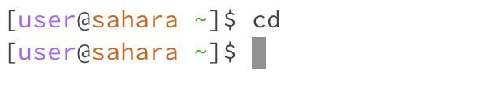
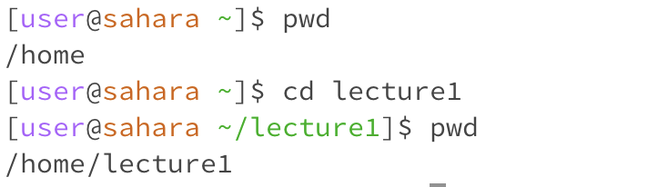
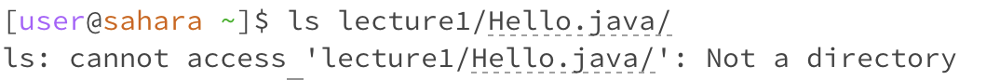
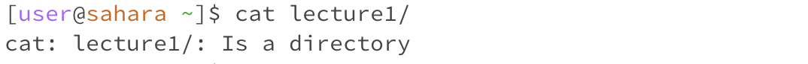
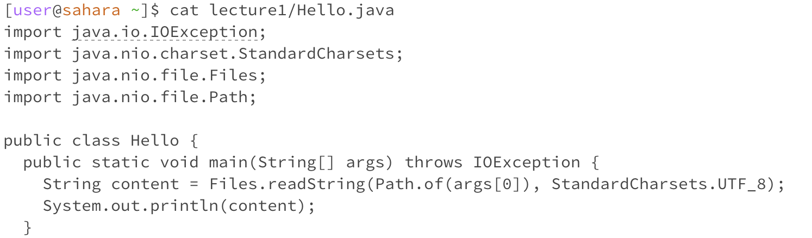

# Lab Report 1
---
- For `cd` command
  
  1. Share an example of using the command with no arguments.
     
     

     > I believe the reason I got this output is because the `cd` command is used to switch to the given directory path. In my case, I used this command without specifying a path, which is why it didn't display anything.
     
  2. Share an exmaple of using the command with a path to a directory as an argument.
 
     

     > The working directory was `/home` when the command was run. Additionally, we can see `/lecture1` displayed after the command was run to indicate the current working directory.
     
  3. Share an example of using the command with a path to a file as an argument.
     
     
     
     > The working directory was `/home/lecture1` when the command was run. The output is an error, I believe the reason we got the output like that is because this java file is not a working directory that we can switch to.

- For `ls` command
  1. Share an example of using the command with no arguments.
     
     

     > The working directory was `/home` when the command was run. `ls` is used to list the files and folders at the given path, so I received this output because there is a file named 'lecture1' under the '/home' directory.
     
  2. Share an exmaple of using the command with a path to a directory as an argument.
     
     

     > The working directory was `/home` when the command was run. This output list out all the things in the lecture1 file.
     
  3. Share an example of using the command with a path to a file as an argument.
     
     

     > The working directory was `/home` when the command was run. The output is an error, because `Hello.java` is a java file containing the code, there is no other file that the `ls` command can list. But if there were more files inside file, `ls` will list them out.

- For `cat` command
  1. Share an example of using the command with no arguments.
     
     

     > The working directory was `/home` when the command was run. `cat` is used to print the contents of files given by the paths, so the output shows nothing because I didn't give it a path to `cat`something.
     
  2. Share an exmaple of using the command with a path to a directory as an argument.
     
     

     > The working directory was `/home` when the command was run. lecture1 is a directory, there are many other file under lecture1, the `cat` command can not print a directory.
     
  3. Share an example of using the command with a path to a file as an argument.
     
     

     > The working directory was `/home` when the command was run. The output print out the code in Hello.java file.
