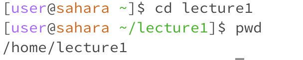

# Lab Report 1
---
- For `cd` command
  
  1. Share an example of using the command with no arguments.
     
     

     I believe the reason I got this output is because the `cd` command is used to switch to the given directory path. In my case, I used this command without specifying a path, which is why it didn't display anything.
     
  2. Share an exmaple of using the command with a path to a directory as an argument.
     
     

     We can see that the output with after using the command  
     
  4. Share an example of using the command with a path to a file as an argument.
     
     
