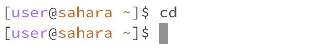
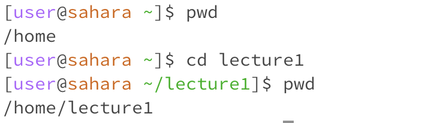
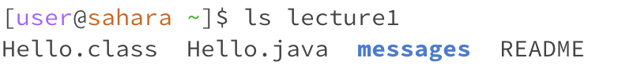
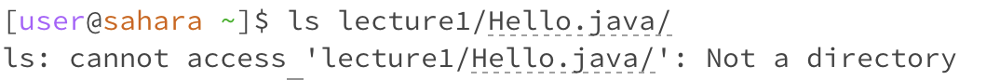
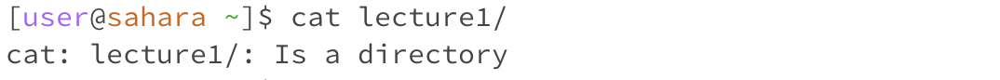
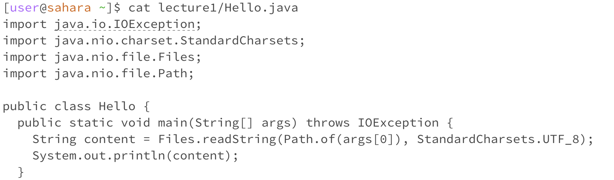

# Lab Report 1
---
- For `cd` command
  
  1. Share an example of using the command with no arguments.
     
     

     > I believe the reason I got this output is because the `cd` command is used to switch to the given directory path. In my case, I used this command without specifying a path, which is why it didn't display anything.
     
  2. Share an exmaple of using the command with a path to a directory as an argument.
 
     

     > We can observe that after using the command with a specified path, the working directory changes to `/home/lecture1`. Additionally, we can see `/lecture1` displayed after user@ to indicate the current working directory.
     
  3. Share an example of using the command with a path to a file as an argument.
     
     
     
     > The `cd` command is used to switch directories. I believe it cannot be used with a file because a file is not a directory that we can switch to.

- For `ls` command
  1. Share an example of using the command with no arguments.
     
     

     > `ls` is used to list the files and folders at the given path. I received this output because there is a file named 'lecture1' under the '/home' directory, so it listed it.
     
  2. Share an exmaple of using the command with a path to a directory as an argument.
     
     

     > This output list out things in the lecture1 file.
     
  3. Share an example of using the command with a path to a file as an argument.
     
     

     > The output is an error, because `Hello.java` is a piece of code, there is no other file that the `ls` command can list.

- For `cat` command
  1. Share an example of using the command with no arguments.
     
     

     > `cat` is used to print the contents of files given by the paths. The output shows nothing because I didn't give it a path to `cat`.
     
  3. Share an exmaple of using the command with a path to a directory as an argument.
     
     

     > lecture1 is kind like a file collection, there are many other file under lecture1, the `cat` command cann't not print the contents of this file collection.
     
  5. Share an example of using the command with a path to a file as an argument.
     
     

     > The output print out the code in Hello.java file.
