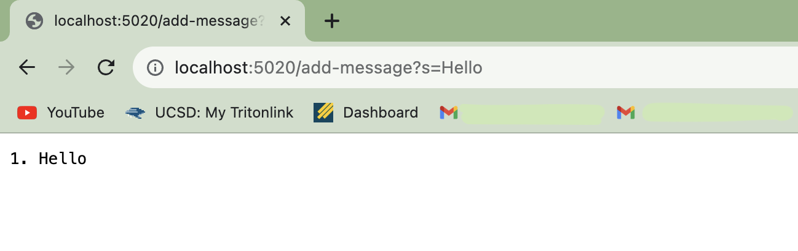
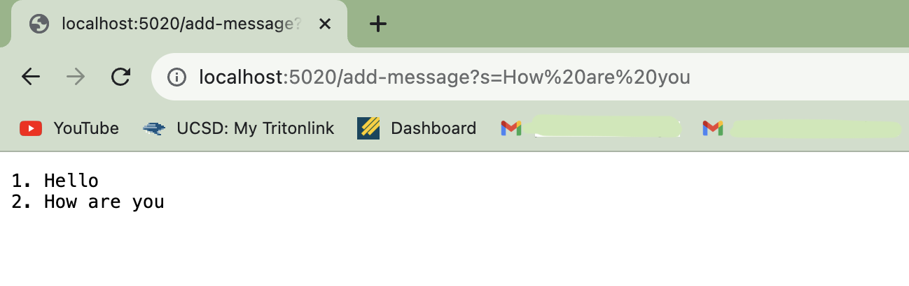
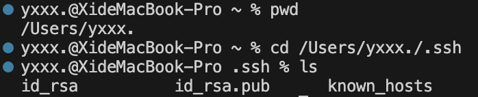
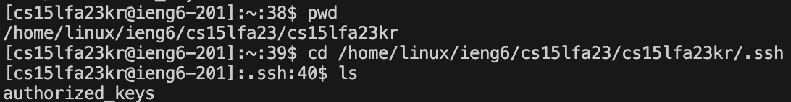
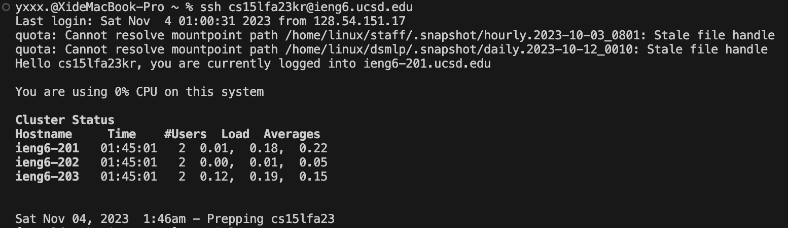

# Lab Report 2
---
## PART 1

- Code:
```
import java.io.IOException;
import java.net.URI;

class Handler implements URLHandler {
    
    String str = "";
    int lineCount = 0;

    public String handleRequest(URI url) {
        if (url.getPath().equals("/")) {
            return str;
            //return String.format("Number: %d", num);
        } else if (url.getPath().equals("/add-message")) {
            String query = url.getQuery();
            if (query != null && query.startsWith("s=")){
                String message = query.substring(2);
                lineCount = lineCount +1;
                str += lineCount + ". " + message + "\n";
                return str;
                
            }
            return "400 Bad Request: Invalid query parameter!";
        } else {
            return "404 Not Found!";
        }
    }
}

class StringServer {
    public static void main(String[] args) throws IOException {
        if(args.length == 0){
            System.out.println("Missing port number! Try any number between 1024 to 49151");
            return;
        }

        int port = Integer.parseInt(args[0]);

        Server.start(port, new Handler());
    }
}
```


- Add message `Hello`
  

- Add message `How are you`
  

> `public String handleRequest(URI url)` is called when a request is made to the server. In the handleRequest method, the `URI url` parameter, `String str` field and `int lineCount` field are relevant. The values of the relevant fields may change depending on the specific request, 1.If the request path is `/`, the handleRequest method simply returns the current value of the str field. In this case, no fields are changed. 2.If the request path is `/add-message`, and the query parameter starts with `s=`, a message is extracted from the query and appended to the str field, along with an incremented line number. The lineCount and str fields are updated to reflect the new message and line count. 3.If the request path is `/add-message`, but the query parameter doesn't start with `s=`, a `400 Bad Request` response is returned, and no fields are changed. 4.For any other request path, a `404 Not Found` response is returned, and no fields are changed.

---
## PART 2
- The path to the private key for your SSH key for logging into ieng6 (on your computer or on the home directory of the lab computer)
  
- The path to the public key for your SSH key for logging into ieng6 (within your account on ieng6)
  
- A terminal interaction where you log into ieng6 with your course-specific account without being asked for a password.
  
  
---
## PART 3
> I have gained a lot in the past three weeks. First of all, in the first week, I learned how to use GitHub and how to create and use repositories. I believe this is a very necessary part of our class because we all are going to need this to complete our lab reports. In the second week, I learned how to connect to a remote server, how to build a server, and run it. I also learned a lot about what URLs are made up of and what each part represents, which I had never delved into before. In the third week, I learned how to set up SSH keys to make it easier for me to connect to a remote server next time. I look forward to learning more in the coming weeks！
