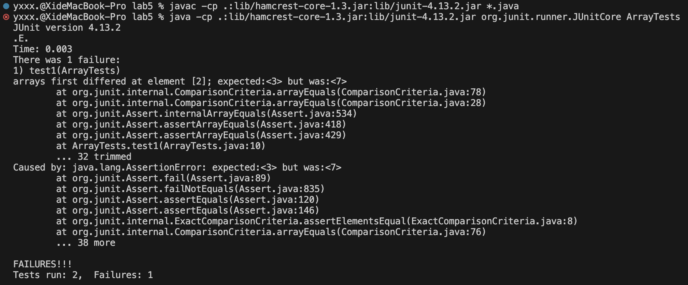

# Lab Report 3
---
## PART 1
- A failure-inducing input for the buggy program, as a JUnit test and any associated code (write it as a code block in Markdown)
  ```
  @Test 
  public void testReverseInPlace() {
    int[] input1 = { 3, 5, 7 };
    ArrayExamples.reverseInPlace(input1);
    assertArrayEquals(new int[]{ 7, 5, 3 }, input1);
  }
  ```
- An input that doesn’t induce a failure, as a JUnit test and any associated code (write it as a code block in Markdown)
  ```
  @Test 
  public void testReverseInPlace() {
    int[] input1 = { 0, 0, 0 };
    ArrayExamples.reverseInPlace(input1);
    assertArrayEquals(new int[]{ 0, 0, 0 }, input1);
  }
  ```
- The symptom, as the output of running the tests (provide it as a screenshot of running JUnit with at least the two inputs above)
  
- The bug, as the before-and-after code change required to fix it (as two code blocks in Markdown)

  Before:
  ```
  // Returns a *new* array with all the elements of the input array in reversed order
  static int[] reversed(int[] arr) {
    int[] newArray = new int[arr.length];
    for(int i = 0; i < arr.length; i += 1) {
      arr[i] = newArray[arr.length - i - 1];
    }
    return arr;
  }
  ```
  After:
  ```
  // Returns a *new* array with all the elements of the input array in reversed order
  static int[] reversed(int[] arr) {
    int[] newArray = new int[arr.length];
    for(int i = 0; i < arr.length; i += 1) {
      newArray[i] = arr[arr.length - i - 1];
    }
    return newArray;
  }
  ```

  > The fix involves swapping the source and destination arrays in the assignment. Now, the `newArray` is correctly populated with the reversed elements of the input array `arr`. This way, the original `arr` remains unchanged, and a new reversed array is created as intended.
  
## PART 2
- Command `find`
  1. Using the -mtime option to search for files by modification time:
     
     Example 1: `find ./technical/911report -type f -mtime -7` Finding files modified within the last 7 days.
     
     
     Example 2: `find ./technical/911report -type f -mtime -30` Searching for files modified within the last 30 days.
     
     
  3. Using the -size option to search for files by size:
     
     Example 1: `find ./technical/biomed -type f -size +100k` Finding files larger than 100KB.
     
     
     Example 2: `find ./technical/biomed -type f -size -10k` Searching for files smaller than 10KB.
     
     
  5. Using the -exec option to perform actions on found files:
     
     Example 1: `find ./technical/government/Post_Rate_Comm -type f -name "*.txt" -exec wc -l {} \;` Finding all text files and running a command to count the lines in each of them.
     
     
     Example 2: `find ./technical/911report -type f -name "*.txt" -exec wc -l {} \;` Count the number of lines in all text files.
     
     
  7. Using the -name option to limit the search depth:
     
     Example 1: `find ./technical/plos -name "*journal*.txt"` searching for files with names containing "journal" and having the ".txt" extension within the ./technical/plos directory and its subdirectories.
     
     
     Example 2: `find ./technical/biomed -iname "*230X*"` searching for files with names containing "230X" (case-insensitive) within the ./technical/biomed directory and its subdirectories.
     

## Citation
- https://www.redhat.com/sysadmin/linux-find-command
  
  [LINK](https://www.redhat.com/sysadmin/linux-find-command)
     
