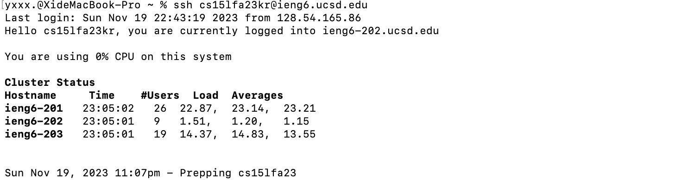
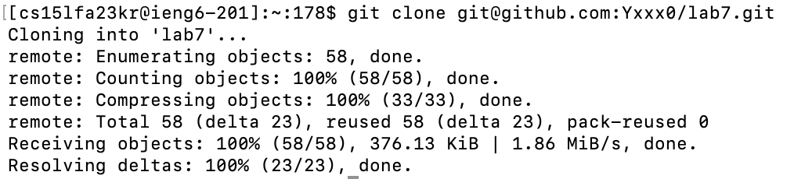
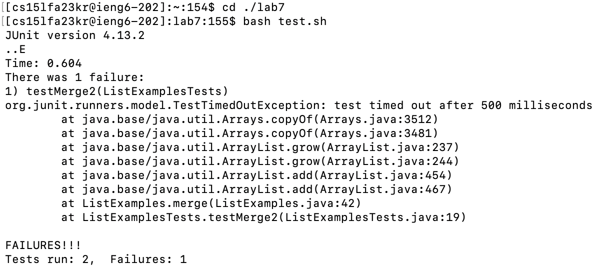
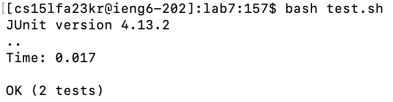
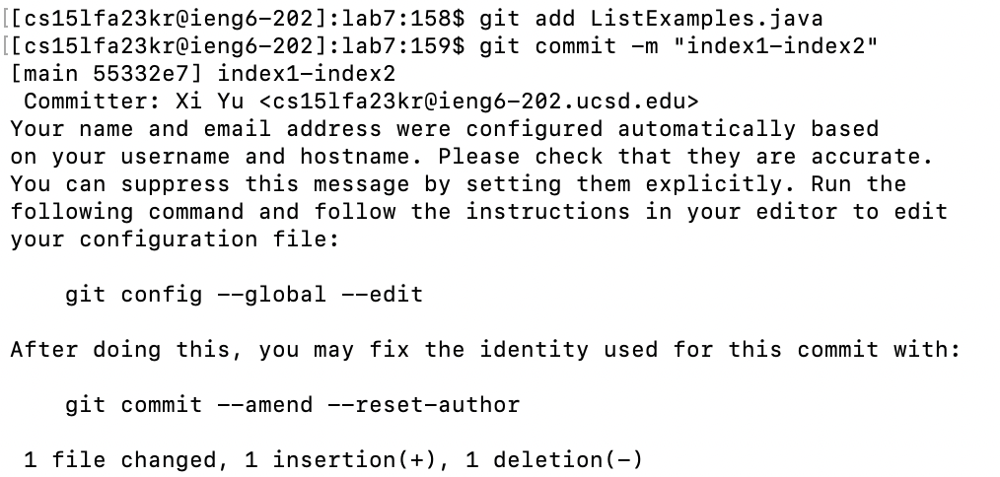
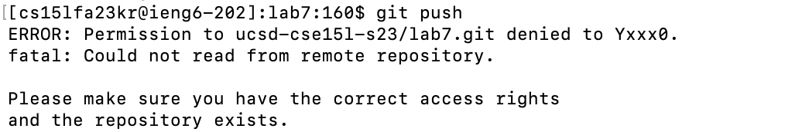

# Lab Report 4
---
## STEP 4: Log into ieng6
key pressed: 

- `ssh cs15lfa23kr@ieng6.ucsd.edu` `<return>` I clearly remembered the login username, so I just typed it in.

## STEP 5: Clone your fork of the repository from your Github account (using the SSH URL)
key pressed: 

- `git clone` `<command> v` `<return>` I've already copied the URL of the repository in Github, so I can just use `git clone` in terminal and paste the URL I just copied to clone the repository. 

## STEP 6: Run the tests, demonstrating that they fail
key pressed:

- `cd` `./lab7` `<return>` make sure the directory is under lab7

- `bash` `test.sh` `<return>` run the test using bash, if the there is .sh file exist.

## STEP 7:
key pressed:

- `vim` `<space>` `L` `<tab>` `.j` `<tab>` `<return>` Using vim to edit the code file, this is what we learn this week.

- `44` `G` The code we need to change is on line 44，G will lead us to line 44 directly.

- `e` `r` `2`  e is to reach the last string in the string which is what we need to change on index1. then we uses r 2 to replace the string “1” to string “2”

- `:wq` `<return>` to save and exit the file.

## STEP 8:
key pressed:

- `<up>` `<up>` `<return>` command was 2 up in the search history, so I used up arrow to access it.

## STEP 9:
key pressed:

- `git add` `L` `<tab>` `<return>` to add ListExamples.java

- 'git commit' `<space>` `-m` `"index1-index2"` `<return>`

- `git push` `<return>` push the changes to the directory.

