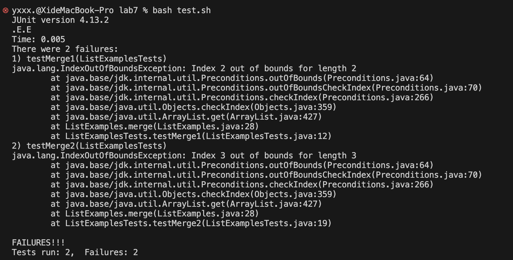

# Lab Report 5
---
## PART 1 
- The original post from a student with a screenshot showing a symptom and a description of a guess at the bug/some sense of what the failure-inducing input is. (Don’t actually make the post! Just write the content that would go in such a post)
  
  > student:
  
    ```
    import java.util.ArrayList;
    import java.util.List;
    
    interface StringChecker { boolean checkString(String s); }
    
    class ListExamples {
    
      // Returns a new list that has all the elements of the input list for which
      // the StringChecker returns true, and not the elements that return false, in
      // the same order they appeared in the input list;
      static List<String> filter(List<String> list, StringChecker sc) {
        List<String> result = new ArrayList<>();
        for(String s: list) {
          if(sc.checkString(s)) {
            result.add(s);
          }
        }
        return result;
      }
    
    
      // Takes two sorted list of strings (so "a" appears before "b" and so on),
      // and return a new list that has all the strings in both list in sorted order.
      static List<String> merge(List<String> list1, List<String> list2) {
        List<String> result = new ArrayList<>();
        int index1 = 0, index2 = 0;
        while(index1 <= list1.size() && index2 <= list2.size()) {
          if(list1.get(index1).compareTo(list2.get(index2)) < 0) {
            result.add(list1.get(index1));
            index1 += 1;
          }
          else {
            result.add(list2.get(index2));
            index2 += 1;
          }
        }
        while(index1 < list1.size()) {
          result.add(list1.get(index1));
          index1 += 1;
        }
        while(index2 < list2.size()) {
          result.add(list2.get(index2));
          // change index1 below to index2 to fix test
          index2 += 1;
        }
        return result;
      }
    
    
    }
    ```
    > Hi everyone, I'm facing issue with the `ListExamples`. This time it's related to the `merge` method. I've attached a screenshot of the problem I'm encountering. I'm trying to merge two sorted lists of strings, but the output is not sorted as expected.
  
  
  
  > My guess is that there's something wrong with the loop condition in the `merge` method or how I'm comparing the strings. Any help would be appreciated!

- A response from a TA asking a leading question or suggesting a command to try (To be clear, you are mimicking a TA here.)

  > Hi there! I've taken a closer look at your merge method, and it seems there might be an issue with the loop condition. The current condition while(index1 <= list1.size() && index2 <= list2.size()) could potentially lead to accessing indices beyond the bounds of your lists.
  >
  > To fix this, could you try updating the loop condition to while(index1 < list1.size() && index2 < list2.size())? This change ensures that the loop stops when either of the lists is fully traversed, preventing any index out-of-bounds issues. Give it a try, and let me know if it resolves the sorting problem you were encountering. Feel free to share the updated output screenshot after making this adjustment.
  > 
  > If you have any questions about why this change is necessary, I'd be happy to explain further!

- Another screenshot/terminal output showing what information the student got from trying that, and a clear description of what the bug is.

  > Thanks for the prompt response! I made the change you suggested, and the output is now sorted correctly. Here's the new screenshot of the output:

    

- At the end, all the information needed about the setup including
  1. The file & directory structure needed
  
    ```
    -lib 
     -hamcrest-core-1.3.jar
     -junit-4.13.2.jar
    -gitignore
    -ListExamples.class
    -ListExamples.java
    -ListExamplesTests.class
    -ListExamplesTests.java
    -StringChecker.class
    -test.sh
    ```
  
  2. The contents of each file before fixing the bug

    ```
    import java.util.ArrayList;
    import java.util.List;
    
    interface StringChecker { boolean checkString(String s); }
    
    class ListExamples {
    
      // Returns a new list that has all the elements of the input list for which
      // the StringChecker returns true, and not the elements that return false, in
      // the same order they appeared in the input list;
      static List<String> filter(List<String> list, StringChecker sc) {
        List<String> result = new ArrayList<>();
        for(String s: list) {
          if(sc.checkString(s)) {
            result.add(s);
          }
        }
        return result;
      }
    
    
      // Takes two sorted list of strings (so "a" appears before "b" and so on),
      // and return a new list that has all the strings in both list in sorted order.
      static List<String> merge(List<String> list1, List<String> list2) {
        List<String> result = new ArrayList<>();
        int index1 = 0, index2 = 0;
        while(index1 <= list1.size() && index2 <= list2.size()) {
          if(list1.get(index1).compareTo(list2.get(index2)) < 0) {
            result.add(list1.get(index1));
            index1 += 1;
          }
          else {
            result.add(list2.get(index2));
            index2 += 1;
          }
        }
        while(index1 < list1.size()) {
          result.add(list1.get(index1));
          index1 += 1;
        }
        while(index2 < list2.size()) {
          result.add(list2.get(index2));
          // change index1 below to index2 to fix test
          index2 += 1;
        }
        return result;
      }
    
    
    }
    ```
    
  3. The full command line (or lines) you ran to trigger the bug

    ```
    static List<String> merge(List<String> list1, List<String> list2) {
        List<String> result = new ArrayList<>();
        int index1 = 0, index2 = 0;
        while(index1 <= list1.size() && index2 <= list2.size()) {
          if(list1.get(index1).compareTo(list2.get(index2)) < 0) {
            result.add(list1.get(index1));
            index1 += 1;
          }
          else {
            result.add(list2.get(index2));
            index2 += 1;
          }
        }
        while(index1 < list1.size()) {
          result.add(list1.get(index1));
          index1 += 1;
        }
        while(index2 < list2.size()) {
          result.add(list2.get(index2));
          // change index1 below to index2 to fix test
          index2 += 1;
        }
        return result;
      }
    ```

  4. A description of what to edit to fix the bug

    > In the merge method, change the loop condition from while(index1 <= list1.size() && index2 <= list2.size()) to while(index1 < list1.size() && index2 < list2.size()). This change ensures that the loop stops when either of the lists is fully traversed, preventing an index out-of-bounds issue.

## PART 2

- In a couple of sentences, describe something you learned from your lab experience in the second half of this quarter that you didn’t know before. It could be a technical topic we addressed specifically, something cool you found out on your own building on labs, something you learned from a tutor or classmate, and so on. It doesn’t have to be specifically related to a lab writeup, we just want to hear about cool things you learned!

  > In the latter part of this quarter's lab sessions, I delved into the world of Vim, a text editor that I had little familiarity with previously. Through hands-on experience and guidance from tutors and classmates, I discovered the efficiency and time-saving capabilities that Vim offers in coding and text manipulation. Learning its various commands and shortcuts not only enhanced my coding workflow but also introduced me to a powerful tool that I hadn't explored before. The newfound proficiency in Vim has proven to be a valuable addition to my technical skill set.
